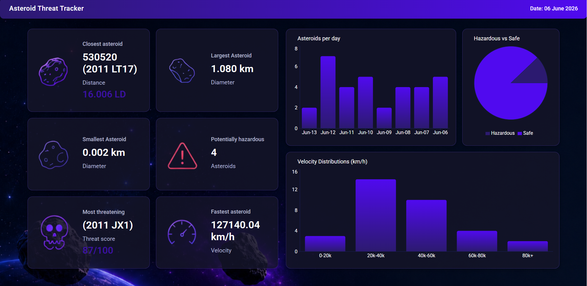

### Overview

A real-time dashboard for monitoring near-Earrth asteroids using NASA NeoWs API. Displays live threat assessments, size comparisons, velocity data and hazard distributions for asteroids approaching Earth.

### Preview

### Features

- **Live NASA data** - fetches todays near-Earth object feed on load
- **6 stat cards** - closest, largest, smallest, fastest, most hazardous count, and most threatening asteroid
- **Threat scoring** - custom algorithm scoring asteroids by size, velocity, and proximity
- **Interactive charts** - daily counts, hazard distribution, and velocity spread

### Visualisations

- **Asteroids Per Day** (Bar Chart) - Number of asteroids per day across the feed window
- **Hazardous vs Safe** (Pie Chart) - Proportion of potentially hazardous vs safe asteroids
- **Velocity Distribution** (Bar Chart) - Asteroid count sorted by speed (km/h)

### Live Demo

Live project available at:  
https://asteroid-threat-tracker.vercel.app/

### Calculations

**Threat Score**
Each asteroid is scored using size, speed and miss distance:  
threatScore = ((diameter_km × velocity_kmh) / miss_distance_lunar) / 10

**Closest Asteroid**
Minimum lunar miss distance (Lunar Years)

**Largest Asteroid**
Maximum average estimated diameter (km)

**Smallest Asteroid**
Minimum average estimated diameter (km)

**Fastest Asteroid**
Maximum relative velocity (km/h)

**Hazardous Count**
Sum of 'is_potentially_hazardous_asteroid === true'

### Tech Stack

**React** — UI framework
**Recharts** — charting library
**NASA NeoWs API** — asteroid data
