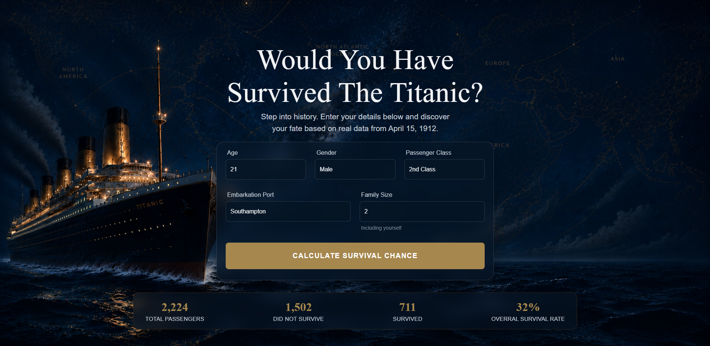
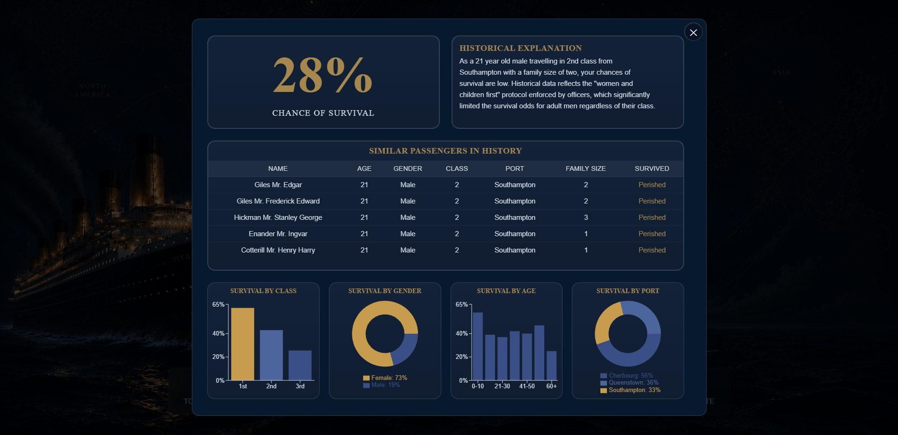

### Overview

An interactive web app that estimates your chances of survival aboard the RMS Titanic based on real passenger data from 1912. User enters age, gender, class, embarkation port, and family size to get a personalised survival percentage, an AI-generated historical explanation, real passengers with similar profiles, and a set of data visualisations exploring survival trends across the full dataset.

---

### Preview

#### Main UI

#### Popup UI

---

### Features

- **Survival Calculator** — enter your details and get a survival percentage calculated from historical Titanic data
- **AI Historical Explanation** — a short, Gemini-generated summary contextualising your result with real historical factors (e.g. "women and children first", class-based lifeboat access)
- **Similar Passengers** — see real passengers from the dataset who shared a similar profile, and whether they survived
- **Data Insights Dashboard** — interactive charts breaking down survival rates by:
  - Passenger class
  - Gender
  - Age group
  - Embarkation port
- **Summary Statistics** — total passengers, survivors, casualties, and overall survival rate

---

### How Survival is Calculated

The predictor combines several historical survival rates queried directly from the dataset, each weighted by how strongly it correlates with survival:

| Factor              | Weight |
| ------------------- | ------ |
| Gender              | 11%    |
| Passenger class     | 10%    |
| Family size         | 5%     |
| Embarkation port    | 5%     |
| Age                 | 5%     |
| Gender × Class      | 23%    |
| Gender × Age        | 15%    |
| Class × Age         | 15%    |
| Class × Family size | 11%    |

This weighted average produces a final survival percentage, which is also passed to the Gemini API to generate a short, historically-grounded explanation of the result.

---

### API Endpoints

| Method | Endpoint                         | Description                                                    |
| ------ | -------------------------------- | -------------------------------------------------------------- |
| GET    | `/api/insights/class`            | Survival percentage grouped by passenger class                 |
| GET    | `/api/insights/gender`           | Survival percentage grouped by gender                          |
| GET    | `/api/insights/age`              | Survival percentage grouped by age bracket                     |
| GET    | `/api/insights/port`             | Survival percentage grouped by embarkation port                |
| POST   | `/api/stats/survival-percentage` | Calculates a survival percentage for a given passenger profile |
| POST   | `/api/stats/similar-passengers`  | Returns real passengers with a similar profile                 |
| POST   | `/api/stats/gemini-summary`      | Generates an AI historical explanation for a given result      |

---

### Dataset

This project uses the [Titanic passenger dataset](https://gist.github.com/teamtom/1af7b484954b2d4b7e981ea3e7a27f24?utm_source=chatgpt.com) (from Vanderbilt Biostat), containing details on 1,309 passengers including age, sex, class, fare, family size, embarkation port, and survival outcome.

---

### Tech Stack

**Frontend**

- React (Vite)
- Recharts for data visualisation

**Backend**

- Flask (Python)
- SQLAlchemy + SQL for querying passenger data
- Google Gemini API for generating historical explanations
- Pandas for dataset cleaning
